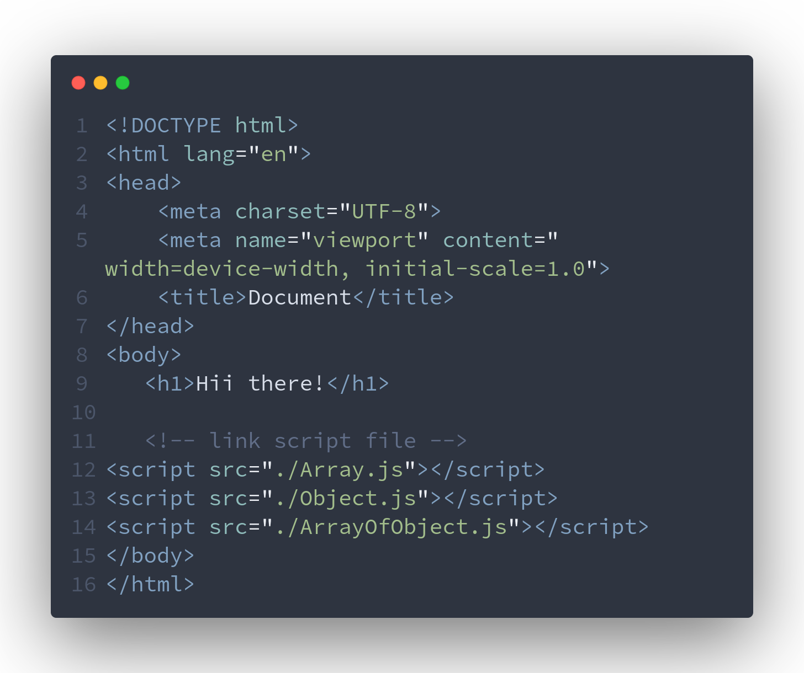
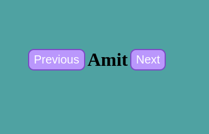

## Assignment-1

  ```index.html ```
  

  ## Array Operation

  ### 1. Create an empty array called "fruit"
  
  ```js
    let fruits = [] //empty array
    console.log(fruits)//[]
  ```

  ### 2. Add the following fruit to the "fruits" array: "apple", "banana", "orange".

  ```js
  //way-1
  fruits.push("apple")
  fruits.push("banana")
  fruits.push("orange")
  //way-2
  //fruits.push("apple","banana","orange") 
  console.log(fruits); // ["apple","banana","orange"] 

  ```

  ### 3. Remove the first fruit from the array

  ```js
fruits.splice(0,1) // splice(index,how many from that index is deleted)
console.log(fruits)//[ 'banana', 'orange' ]

  ```

  ### 4. Add "grape" to the end of the array
  ```js
  fruits.push("grape") 
  console.log(fruits) //[ 'banana', 'orange', 'grape' ]
  ```

  ### 5. Update the second fruit in the array to "pear".

```js
fruits.splice(1,1,"pear"); //splice(index,howmany,what add in that place)
console.log(fruits) //[ 'banana', 'pear', 'grape' ]
```

### 6. Print the final "fruits" array after performing the above operations.

```js
console.log(fruits);//[ 'banana', 'pear', 'grape' ]
```

## Objects

### 1.Create an empty object called "person"

```js
let person = {} //empty object
console.log(person)//{}
```

### 2.Add the following property from the "person" object: name : "John", age:30, city:"New York"

```js
// way-1
person.name = "John"
person.age=30
person.city= "New York" 

//way-2
// person={
//     name:"John",
//     age:30,
//     city:"New York"
// }

console.log(person)//{ name: 'John', age: 30, city: 'New York' }

```

### 3. Remove the age property from the "person" object
```js
delete person.age //delete the age property from person
console.log(person) //{ name: 'John', city: 'New York' }

```
### 4. Add a new property called "job" with the value "Engineer" to the "person" object

```js

person.job = "Engineer"
console.log(person) //{ name: 'John', city: 'New York', job: 'Engineer' }

```
### 5. Update the "city" propert of the person object to "San Francisco".

```js
person.city = "San Francisco"
console.log(person)//{ name: 'John', city: 'San Francisco', job: 'Engineer' }
```

### 6. Print the final 'person' object after performing the above operations.
```js
console.log(person) //{ name: 'John', city: 'San Francisco', job: 'Engineer' }
```


## ArrayOfObjects

### 1. Create a array of an objects.

```js
let cars = [] //empty array
console.log(cars) //[]
```
### 2.Add three car objects to the "cars" array.Each car object should have the following properties: make:"Toyota",model:"Camry",year:2018

```js
cars.push({
    make: "Toyota",
    model: "Camry",
    year: 2018
},
{
    make: "Toyota",
    model: "Camry",
    year: 2018
},{
    make: "Toyota",
    model: "Camry",
    year: 2018
}
)

console.log(cars)//[{ make: 'Toyota', model: 'Camry', year: 2018 },{ make: 'Toyota', model: 'Camry', year: 2018 },{ make: 'Toyota', model: 'Camry', year: 2018 }]
```

### 3. Remove the first car object from the "cars" array.

```js
cars.splice(0,1)//delete the first car object
console.log(cars)//[ { make: 'Toyota', model: 'Camry', year: 2018 },{ make: 'Toyota', model: 'Camry', year: 2018 }]
```

### 4. Add a new car object to the "cars" array with the following properties: make:"Honda",model:"Civic",year:2020

```js
cars.push({
    make:"Honda",
    model:"Civic",
    year:2020
})
console.log(cars)//[{ make: 'Toyota', model: 'Camry', year: 2018 },{ make: 'Toyota', model: 'Camry', year: 2018 },{ make: 'Honda', model: 'Civic', year: 2020 }]
```

### 5.Update the "model" property of the second car object in the array to "Accord".

```js
cars[1].model ="Accord"//update model at 2nd car
console.log(cars)//[ { make: 'Toyota', model: 'Camry', year: 2018 },{ make: 'Toyota', model: 'Accord', year: 2018 },{ make: 'Honda', model: 'Civic', year: 2020 }]
```

### 6. Print the final "cars" array after performing the above operations.

```js
console.log(cars)//[ { make: 'Toyota', model: 'Camry', year: 2018 },{ make: 'Toyota', model: 'Accord', year: 2018 },{ make: 'Honda', model: 'Civic', year: 2020 }]
```


## Assignment 2

### 1. Solution

```js

let n = 9;

function checkNumber(num){
    if(n==0) return "zero"
    if(n>0) return "positive"
    if(n<0) return "negative"
}

const result = checkNumber(n);
console.log(`Entered Number is ${result}`)
```


### 2. Solution

```js


let n = 5

function findFactorial(num) {

    if (num === 0) return 1;
    let fact = 1;
    for (let i = 1; i <=num; i++) {
        fact = fact * i;
    }
    return fact;
}


const result = findFactorial(n)//5->120

console.log(result)//120

```

### 3. Solution

```js
let a=43,b=12;

function largestNumber(a,b){
    return a>b ? a :b;

}


console.log(largestNumber(a,b))//12
```


### 4. Solution

```js

let isPalindromeString = "gfg"  // "gfg", "lol"

function checkPalindromeString(str){

if (str === str.split("").reverse().join("")) return true

return false
}

console.log(checkPalindromeString(isPalindromeString))//true
```

### 5.Solution 

```js
let number = 35


function isPrimeNumber(num) {
    if (num === 2) return true;
    if (num % 2 === 0) return false;
    for (let i = 2; i < num; i++) {
        if (num % i == 0) return false
    }
    return true

}

function printAllPrimeNumberUptoN(n){
    for(let i =2;i<n;i++) {
        if(n===1) break;
        if (isPrimeNumber(i)) {
            console.log(i)
        }
    }

}

printAllPrimeNumberUptoN(number)


```


### 6. Solution 

```js


function calculator(a,b,operator){
    if(operator=='+') return a+b;
    if(operator=='-') return a-b;
    if(operator=='*') return a*b;
    if(operator=='/') return a/b;
    if(operator=='%') return a%b;
    
}

console.log(calculator(2,3,'*'))//6
console.log(calculator(2,3,'+'))//5
console.log(calculator(2,3,'-'))//-1
console.log(calculator(2,3,'/'))//0.6666666666
console.log(calculator(10,3,'%'))// 1

```

### 7. Solution
```js

function countVowel(str){
    let count = 0;
    let strArray = str.split("");
    for(let i=0;i<strArray.length;i++){
        if(
            strArray[i]==='a' || strArray[i]==='A' ||
            strArray[i]==='e' || strArray[i]==='E' ||
            strArray[i]==='i' || strArray[i]==='I' ||
            strArray[i]==='o' || strArray[i]==='O' ||
            strArray[i]==='u' || strArray[i]==='U' 
                 
            
            ) {
           ++count
        }
    }


    return count;
}


console.log(countVowel("Amresh"))//2
console.log(countVowel("Ashish"))//2
console.log(countVowel("Shubhangi"))//3
console.log(countVowel("Abhiuday"))//4
console.log(countVowel("Vedant"))//2


```


### 8. Solution

```js
//perfect Square or not - 6, 28, 496, 8128
// 28 ---> 1,2,4,7,14,   28(exclude)
// 1+2+4+7+14 =28 


function isPerfectNumber(num){
let factorSum = 0;
for(let i = 1;i<num;i++){
    if(num%i===0) factorSum +=i;
}

if(factorSum === num) return true;

return false;


}


console.log(isPerfectNumber(28)) //true
console.log(isPerfectNumber(128)) // false
console.log(isPerfectNumber(496)) //true

```

### 9. Solution

```js
// fibonacci

function fibonacciSeries(n) {
    
    let f1 = 0, f2 = 1;
    let nextF = f1 + f2;
    console.log(f1)
    console.log(f2)
    for (let i = 3; i <= n; i++) {
        console.log(nextF)
        f1 = f2;
        f2 = nextF;
        nextF = f1 + f2

    }

}

fibonacciSeries(5) // 0 1 1 2 3
console.log()
fibonacciSeries(15) // 0 1 1 2 3 5,8,13,21,34,55,89,144,233,377


```

### 10. Solution

```js

// table

function printTableUpto10(num){

    for(let i =1; i<=10;i++) {
        console.log(i*num)
    }
}


printTableUpto10(5)
console.log()
printTableUpto10(15)
console.log()
printTableUpto10(25)

```

## Assignment 3

### 1.Background Change


```sh 
index.html
```

```html
<!DOCTYPE html>
<html lang="en">
  <head>
    <meta charset="UTF-8" />
    <meta name="viewport" content="width=device-width, initial-scale=1.0" />
    <title>Change Background Color</title>
  </head>
  <body class="container"  onclick="changeBackgroundColor()" >
    

  <div class="box" onclick="()=>{}">
    <input type="text" id="hexbox" /> 
    <h3 id="hexbox"></h3>
    <button class="btn" onclick="changeBackgroundColor()">
      Change Color
    </button>
  </div>


    <style>
      * {
        margin: 0;
        padding: 0;
        box-sizing: border-box;
      }
     .container{
        width: 100vw;
        height: 100vh;
      
        display: flex;
        flex-direction: column;
        justify-items: center;
        justify-content: center;
        align-items: center;
        gap: 4px;

     }

     .box{
        display: flex;
        flex-direction: column;
        justify-items: center;
        justify-content: center;
        align-items: center;
        gap: 4px;
     }
   
      .btn {
        background-color: #b0b0fa;
        color: #fff;
        padding: 5px 8px 5px 8px;
        border-radius: 10px;
        font-size: 20px;
        width: fit-content;
        outline: none;
        border: none;
        border:2px solid  #6f6fc2;
        
      }
      .btn:hover{
        background-color: #6f6fc2;
        
      }

      #hexbox{
        outline: none;
      }
    </style>

    <script src="./script.js"></script>
  </body>
</html>

```

```sh
script.js
```

```js
const container = document.querySelector('.container');
const hexbox = document.getElementById('hexbox');


const color = ['0', '1', '2', '3', '4', '5', '6', '7', '8', '9', 'a', 'b', 'c', 'd', 'e', 'f']


// random color generator
function getRandomColor() {
    const pt1 = color[Math.floor(Math.random() * 16)];
    const pt2 = color[Math.floor(Math.random() * 16)];
    const pt3 = color[Math.floor(Math.random() * 16)];
    const pt4 = color[Math.floor(Math.random() * 16)];
    const pt5 = color[Math.floor(Math.random() * 16)];
    const pt6 = color[Math.floor(Math.random() * 16)];

    const randomColor = `#${pt1}${pt2}${pt3}${pt4}${pt5}${pt6}`
    hexbox.value = randomColor
    return randomColor

}

// background color
function changeBackgroundColor() {
    container.style.backgroundColor = getRandomColor()

}

changeBackgroundColor()


//copy
function copyTextContent() {

    // Select the text field
    hexbox.select();
    hexbox.setSelectionRange(0, 99999); // For mobile devices

    // Copy the text inside the text field
    navigator.clipboard.writeText(hexbox.value);


}


//on click anywhere in body, change the color
container.addEventListener('click', () => {
    changeBackgroundColor()
    hexbox.addEventListener('hover', copyTextContent())
    console.log("body listener")
});


```


### 2.Display Names



```sh
index.html
```

```html
<!DOCTYPE html>
<html lang="en">
  <head>
    <meta charset="UTF-8" />
    <meta name="viewport" content="width=device-width, initial-scale=1.0" />
    <title>Display Names</title>
  </head>
  <body class="container">
    <div class="box">
      <button id="prev" class="btn" onclick="showPreviousName()">
        Previous
      </button>
      <h1 id="name"></h1>
      <button id="next" class="btn" onclick="showNextName()">Next</button>
    </div>
    <style>
      * {
        margin: 0;
        padding: 0;
        box-sizing: border-box;
      }
      .container {
        width: 100vw;
        height: 100vh;
        background-color: cadetblue;
        display: flex;
        flex-direction: column;
        justify-items: center;
        justify-content: center;
        align-items: center;
        gap: 4px;
      }

      .box {
        display: flex;
        flex-direction: row;
        justify-items: center;
        justify-content: center;
        align-items: center;
        gap: 4px;
      }

      .btn {
        background-color: #b0b0fa;
        color: #fff;
        padding: 5px 8px 5px 8px;
        border-radius: 10px;
        font-size: 20px;
        width: fit-content;
        outline: none;
        border: none;
        border: 2px solid #6f6fc2;
      }
      .btn:hover {
        background-color: #6f6fc2;
      }
    </style>

    <script src="./script.js"></script>
  </body>
</html>


```


```sh 
script.js
```

```js
const showName = document.getElementById("name");
const prev = document.getElementById("prev");
const next = document.getElementById("next");

const names = [
  "Aarav",
  "Sanya",
  "Vikram",
  "Neha",
  "Rohan",
  "Priya",
  "Amit",
  "Meera",
  "Rajiv",
  "Ananya",
];
console.log(names);

//initial name on load
showName.innerText = names[0];

let currentState = {
  value: 0,
};

//next fun
const showNextName = () => {
  if (currentState.value === names.length - 1) currentState.value = -1;

  showName.innerText = names[++currentState.value];
};

//prev fun
const showPreviousName = () => {
  if (currentState.value === 0) currentState.value = names.length;

  showName.innerText = names[--currentState.value];
};


```